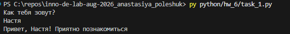
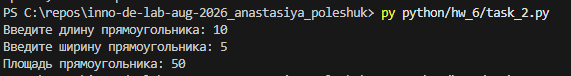
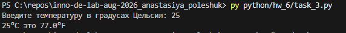
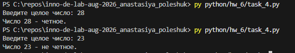
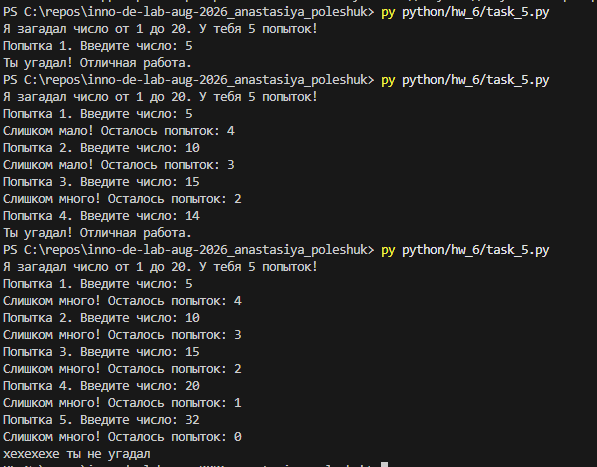
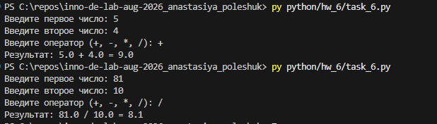
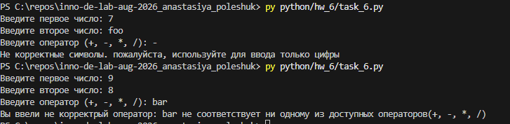

# Homework 6 — Python: intro, cycles

## [Task 1. Greetings](./task_1.py)

## [Task 2. Area of a Rectangle](./task_2.py)

## [Task 3. Temperature Converter](./task_3.py)

## [Task 4. Checking a Number for Evenness](./task_4.py)

## [Task 5. Guess the Number Game](./task_5.py)

## [Task 6. Calculator](./task_6.py)

