## RESULTS — Homework 4

### task_DDL

- [SQL script](./task_DDL.sql)
- Result: created the `Departments` table; added the `Email` column to `Employees`, populated it, and applied a unique constraint. The `Location` column was renamed to `OfficeLocation`.

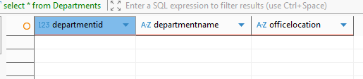

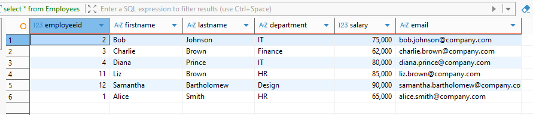

### task_DML

- [SQL script](./task_DML.sql)
- Result: added Liz Brown and Samantha Bartholomew; selected all employees and the employees from the `IT` department; updated Alice Smith's salary to `65000.00`; deleted Eve Davis; and checked the final contents of `Employees`.

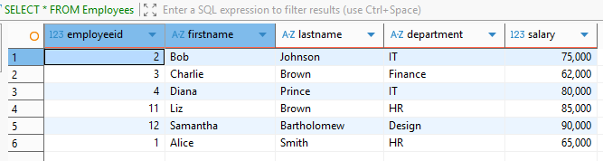

### task_DCL

- [SQL script](./task_DCL.sql)
- Result: created the `hr_user` role and granted `SELECT` access to `Employees`. `INSERT` was initially denied; after granting `INSERT`, `UPDATE`, and `USAGE` on `employees_employeeid_seq`, inserting a new employee succeeded.

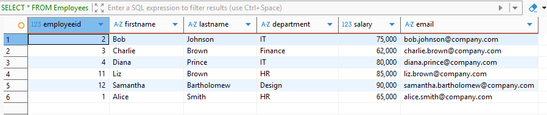

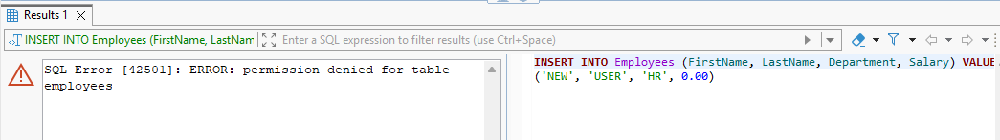

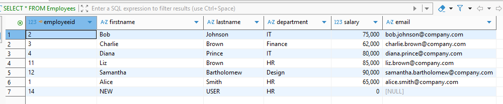

### task_DML_DCL

- [SQL script](./task_DML_DCL.sql)
- Result: increased salaries in the `HR` department by 10%; changed the department to `Senior IT` for employees with a salary above `70000.00`; removed employees without project assignments; and, in a transaction, created the `Data Warehouse` project and assigned it to employees with IDs `3` and `4`.

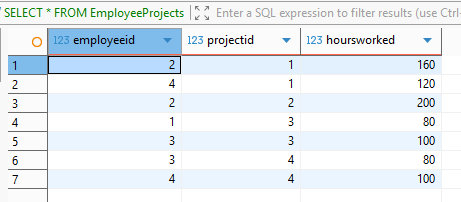

### task_6.DML

- [SQL script](./task_6.DML.SQL)
- Result: selected Bob Johnson's projects with more than 150 hours worked; increased the budget by 10% for projects staffed by the `Senior IT` department; set a one-year end date for projects without one; and, in a transaction, created Anna Taylor and assigned her to the `Website Redesign` project.

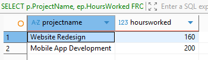

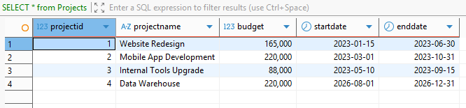

### task_func

- [SQL script](./task_func.sql)
- Result: created the `CalculateAnnualBonus` function, which returns 10% of an employee's salary; displayed employee bonuses; created `IT_Department_View` for the `Senior IT` department; and displayed the view.

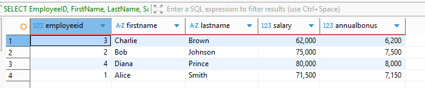

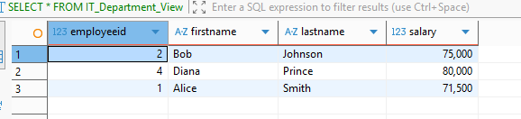
