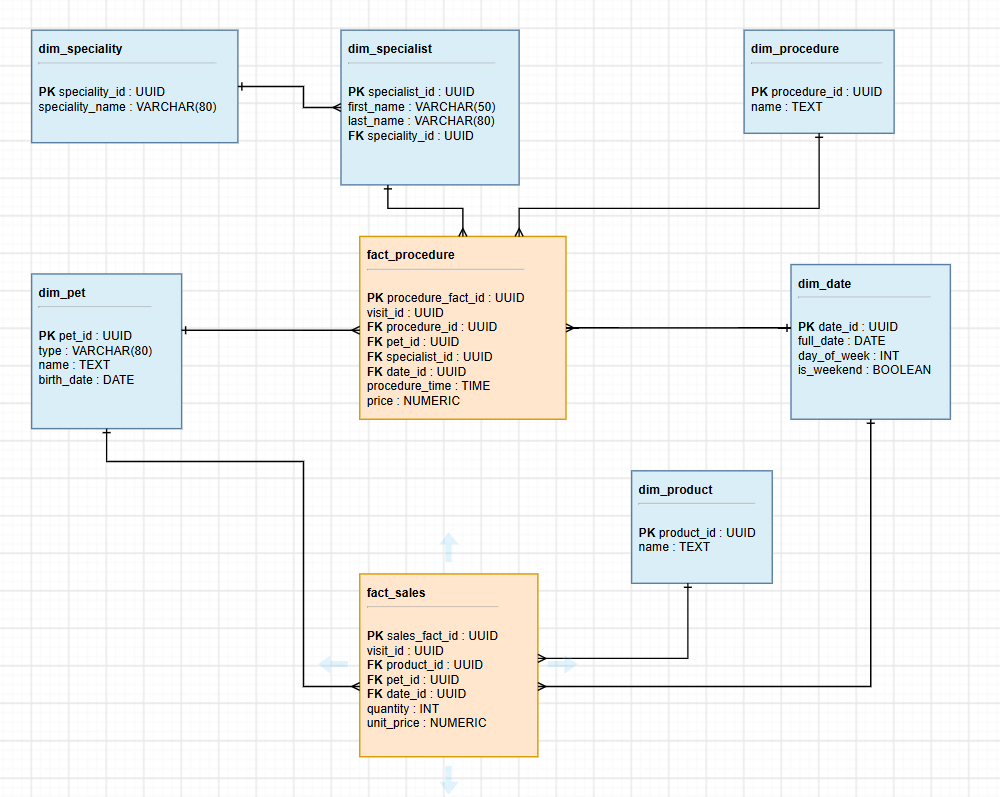

# Vet clinic analytics

## Business Process

The selected business process is managing pet visits at a vet clinic. During a visit, not only can procedures be performed, but additional products can also be sold. This model makes it possible to analyze the most popular procedures and products, specialists workload, and the clinic's overall workload.

## Data model

### Grain

 - `fact_procedure` - row represents one procedure performed during a visit
 - `fact_sales` - one row represents one product line sold during a visit

The decision to store procedures and product sales as separate rows is based on the fact that several procedures can be performed and several products can be sold during a single visit. Storing an entire visit as one row would make further analysis of individual procedures and products more difficult.

### Fact Tables

In `fact_procedure`, each row represents one performed procedure. 
dimension tables: `dim_specialist`, `dim_procedure`, `dim_pet`,  `dim_date`.

In `fact_sales`, each row represents one product line sold during a visit. 
dimension tables: `dim_product`, `dim_pet`, `dim_date`.

* `quantity` represents the number of units of a product sold 
* `unit_price` represents the price of one unit.

`quantity` is stored in `fact_sales` rather than `dim_product` because `dim_product` describes the product itself, but the number of units sold during a visit is a fact about a specific sale.

The `visit_id` identifies the visit and makes it possible to determine which procedures or product sales belong to the same visit.

### Dimension Tables

- `dim_pet` contains information about pets. It can be used to analyze which types of pets visit the clinic most often. Since `dim_pet` is also connected to `fact_sales`, it is possible to analyze which products are most frequently purchased for different types of pets.

- `dim_specialist` contains information about the clinics specialists. It can be used to analyze specialists workload based on the number of procedures they perform.

- `dim_speciality` contains information about specialists specialities. The speciality is stored separately from `dim_specialist` to avoid repeating the same speciality name for multiple specialists and to make it possible to analyze data by speciality.

- `dim_procedure` contains the list of procedures available at the clinic and allows procedures to be used as an analytical dimension.

- `dim_product` contains the list of products available for additional sales at the clinic.

- `dim_date` contains information about calendar dates related to events stored in the fact tables. It makes it possible to analyze procedures and sales by date, day of the week, and other calendar characteristics.

### Schema Design

The Snowflake schema was selected because `dim_specialist` and `dim_speciality` are stored as separate related dimension tables. This reduces duplication of speciality information and allows speciality to be analyzed separately.

## Analytical questions

### 1. What were the most popular procedures in July 2026?

The query returns procedures ranked by the number of recorded procedures in July 2026.

- [most_popular_procedure.sql](./most_popular_procedure.sql)

### 2. What were the best-selling additional products in July 2026?

The query returns additional products ranked by total units sold in July 2026.

- [most_popular_product.sql](./most_popular_product.sql)

### 3. Which specialists performed the most procedures in July 2026?

The query returns specialists ranked by the number of procedures they performed in July 2026

- [top_spetialist.sql](./top_spetialist.sql)

### 4. On which days of the week was the clinic busiest in 2026?

The query returns days of the week ranked by the number of procedures in 2026, together with the `is_weekend` flag.

- [clinic_load_by_weekday.sql](./clinic_load_by_weekday.sql)
