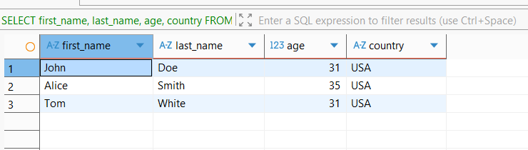
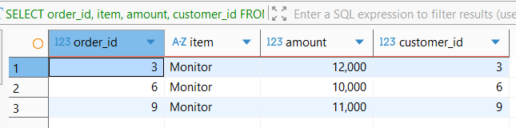
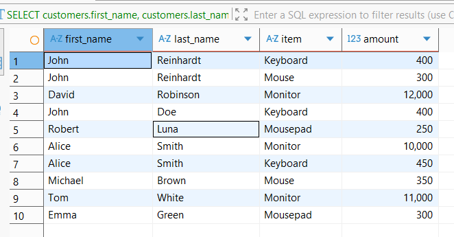
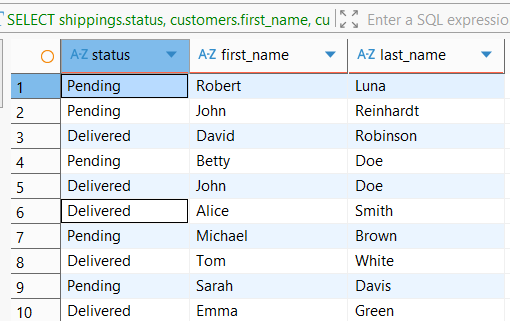
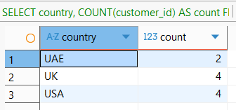
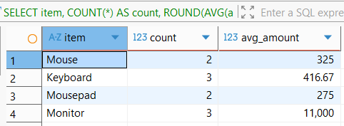
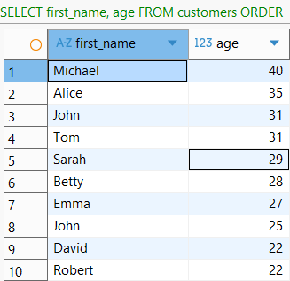
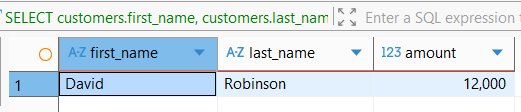
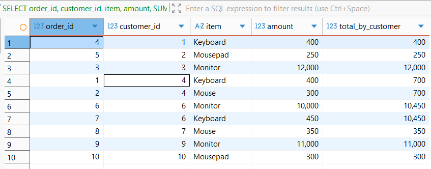
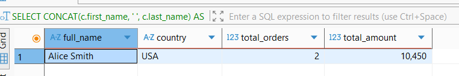

## RESULTS

### task_1.1

- [SQL request](./queries/task_1.1.sql)
- Результат: 3 клиента старше 25 лет из USA — John Doe, Alice Smith и Tom White.

### task_1.2

- [SQL request](./queries/task_1.2.sql)
- Результат: 3 заказа дороже 1000 — заказы №3, №6 и №9.

### task_2.1

- [SQL request](./queries/task_2.1.sql)
- Результат: 10 строк с клиентами и их заказами.

### task_2.2

- [SQL request](./queries/task_2.2.sql)
- Результат: 10 строк со статусами доставки и именами клиентов.

### task_3.1

- [SQL request](./queries/task_3.1.sql)
- Результат: UAE — 2 клиента, UK — 4, USA — 4.

### task_3.2

- [SQL request](./queries/task_3.2.sql)
- Результат: агрегированные количество и средняя сумма заказов по каждому товару.

### task_4.1

- [SQL request](./queries/task_4.1.sql)
- Результат: 10 клиентов, отсортированных по убыванию возраста.

### task_5.1

- [SQL request](./queries/task_5.1.sql)
- Результат: максимальная сумма заказа — 12 000; клиент David Robinson.

### task_6.1

- [SQL request](./queries/task_6.1.sql)
- Результат: 10 заказов с суммой заказов каждого клиента (`total_by_customer`).

### task_7.1

- [SQL request](./queries/task_7.1.sql)
- Результат: John Reinhardt — 2 заказа на 700, Alice Smith — 2 заказа на 10 450.

